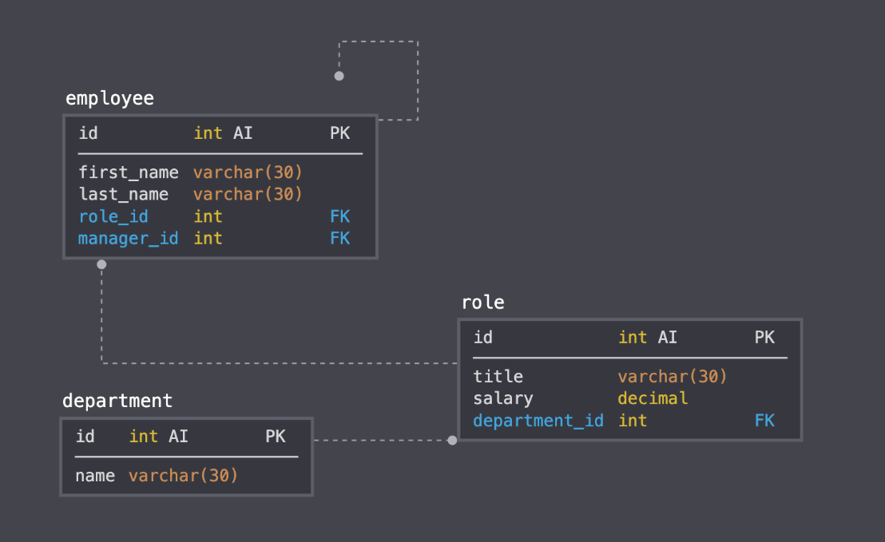

# MySQL-Employee-Tracker

This Application allows the user to manage A database of employees records regarding Role, Wage, and Direct Reports.

## About

Prompts you will see when using this application.

* View All Employees - Displays all employees in a table. Table contains employee id, employee name, title, department, salary and employee manager.

* View All Employees By Manager - Displays all employee managers and their associates.

* View All Employees By Department - Displays all departments and the employee under it.

* View All Roles - command that Displays all roles/ title and the corresponding employee.

* Add An Employee - Adds a new entry to the database.

* Remove An Employee - Deletes an employee from the database

* Update Employee Role - Updates the role/ title of an employee.

## Installation
* npm i - to install all file in order for npm to work
* npm i inquirer - to use inquirer (to interact with the user via command line)
* npm init - to create a json file
* npm i mysql - to connect to MySql database
* npm console.table - to format tables

## Run 
* node index.js

## Design

## Demo
https://drive.google.com/file/d/1ycjjQCeEhAxuCH7tokb6iSZT-Zlk4JNf/view

## Dependencies

* "console.table": "^0.10.0",
* "init": "^0.1.2",
* "inquirer": "^8.2.0",
* "mysql": "^2.18.1"

## Technologies
* JavaScript
* Node.js
* MySQL

## License
MIT